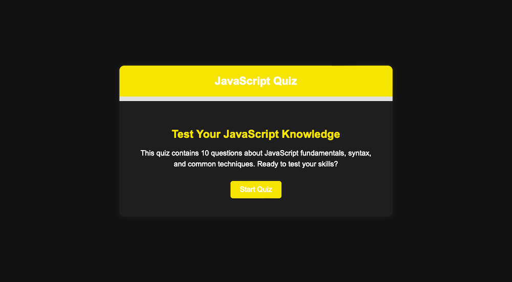

# 🎯 JavaScript Quiz App

A fun, interactive quiz game built with **pure vanilla JavaScript**. Test your JavaScript knowledge through a dynamic 10-question multiple-choice quiz — complete with progress tracking, instant feedback, and a clean dark-themed UI.

## 🚀 Features

- ✅ 10 randomized multiple-choice JavaScript questions
- 🧠 Immediate visual feedback for correct/incorrect answers
- 🔒 "Next Question" button disabled until an answer is selected
- 📊 Progress bar that tracks your quiz completion
- 🏁 Final summary screen with performance-based feedback
- 🔁 Option to restart the quiz anytime
- 🌙 Fully dark-themed UI for a modern look
- 🔥 Responsive design for all devices
- 🎉 Start screen with quiz intro and a "Start Quiz" button
- 🧠 Questions shuffled every time you restart (Fisher–Yates)

## 🛠 Tech Used

- **Vanilla JavaScript** (no frameworks or libraries)
- **HTML5**
- **CSS3**

Just DOM manipulation, event handling, and JavaScript logic — simple and powerful.

## 📸 Preview



## 🧩 How It Works

- Questions are stored in an array of objects and shuffled using the Fisher–Yates algorithm.
- DOM manipulation dynamically updates the question text, choices, and progress.
- Event listeners handle user input and state changes (score, question index, etc.).
- UI transitions between Start, Quiz, and Completion screens.

## 🔧 How to Run

1. Clone this repo:
   ```bash
   git clone https://github.com/crnjihia/JavaScript-Quiz-App.git


2. Open `index.html` in your browser.

No setup or build steps required — just open and play!

## 📁 Project Structure

```
/js-quiz-master
├── index.html
├── style.css
├── script.js
├── screenshot.png
└── README.md
```

## 🔗 Live Demo

[🔗 Try the Quiz Live!](https://crnjihia.github.io/JavaScript-Quiz-App/)

## 🤝 Contributing

Got suggestions or improvements? Feel free to fork the repo, open issues, or submit a pull request!

## 📜 License

This project is licensed under the [MIT License](LICENSE).
